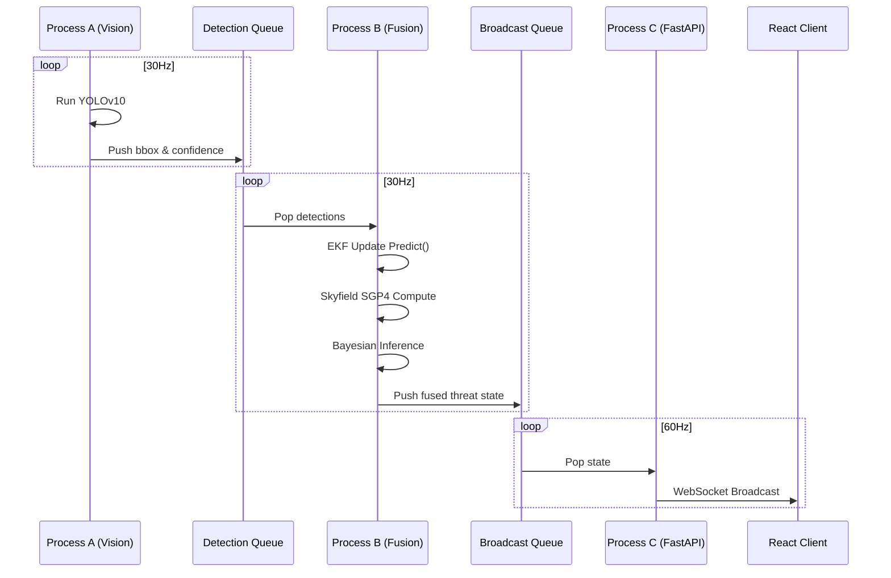

  

# Architecture Deep Dive

Project Sudarshan uses a **Deterministic Asynchronous Multi-Processing** architecture to isolate heavy ML inference and complex matrix math from the networking and UI layers.

## The IPC Pipeline (Inter-Process Communication)

To achieve zero-lag execution, the system avoids Python's Global Interpreter Lock (GIL) by utilizing three distinct OS-level processes connected via `multiprocessing.Queue`.

## Agent Design

1. **Vision Agent (Process A)**
   - Bound to GPU (if available).
   - Sole responsibility is turning pixels into bounding box coordinates.

2. **Kinematic & Orbital Agent (Process B)**
   - Bound to CPU. Matrix operations benefit from high single-core clocks.
   - Maintains the state history of tracks. If Process A drops a frame, Process B uses the Kalman Filter's state transition matrix to predict the target's current position, keeping the UI smooth.

3. **Event Bus (Process C)**
   - Bound to Async I/O network operations.
   - Uses `uvicorn` and FastAPI WebSockets to blast JSON payloads to an unlimited number of subscribed browser clients.

## Data Schema (Pydantic)
Strict boundaries ensure IPC safety. All data pushed into queues is validated via Pydantic schemas defined in `backend/models/`.
