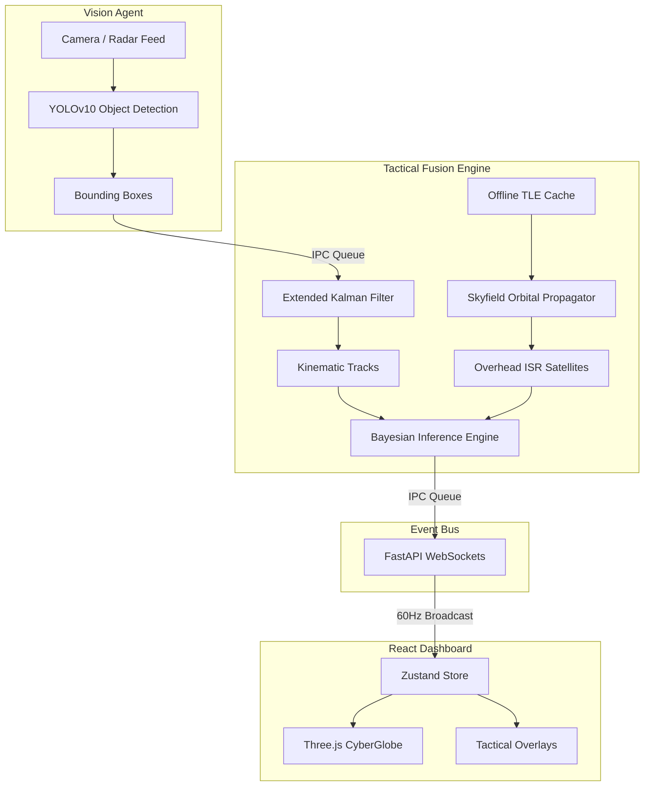

<div align="center">
  

  <h1>PROJECT SUDARSHAN</h1>
  <p><strong>Quad-Domain Autonomous C4ISR | Air · Land · Sea · Space</strong></p>
  <p><i>Submission for FAR AWAY 2026: India's Biggest International Hackathon</i></p>

  <p>
    
    
    
    
  </p>
</div>

---

## 🎯 Problem Statement
Modern military and border security operations suffer from **Sensor Fragmentation**. Radar tracks, drone video feeds, and satellite orbital data live in isolated silos. When an unknown UAV crosses a border, operators must mentally fuse radar blips with grainy video and calculate if an adversary satellite is currently flying overhead photographing the response. This cognitive overload leads to delayed threat neutralization.

## 💡 The Solution
**Project Sudarshan** is a deterministic, air-gapped edge-computing node that acts as an autonomous command nexus. It ingests computer vision streams, tracks kinematic trajectories, calculates real-time satellite orbital mechanics, and uses **Bayesian Probability** to statistically fuse these weak, isolated signals into high-confidence threat profiles.

Built entirely for edge hardware, Sudarshan requires **zero cloud dependencies** and operates offline to survive electronic warfare environments.

---

## 🚀 Key Features

*   **🛰️ Orbital Intelligence (SGP4):** Autonomously calculates the Topocentric coordinates (Elevation, Azimuth, Range) of every active satellite passing overhead to evaluate surveillance risk.
*   **🎯 Extended Kalman Filter (EKF):** Predicts the kinematic path of UAVs/Vessels, seamlessly tracking targets even when they fly behind mountains or clouds (Occlusion Bridging).
*   **🧠 Bayesian Sensor Fusion:** Fuses Vision Confidence (YOLOv10), Kinematic Speed, and Orbital Risk to calculate a unified Mathematical Threat Probability.
*   **⚡ Zero-API Architecture:** Runs 100% locally via isolated Python multiprocessing queues, ensuring the heavy math never bottlenecks the React UI.

---

## 🛠️ Tech Stack & Architecture

### The Agents (Backend)
- **Computer Vision:** `Ultralytics YOLOv10`, `OpenCV`
- **Kinematic & Math:** `NumPy`, `SciPy` (Mahalanobis Distance, NMS)
- **Orbital Dynamics:** `Skyfield`, `sgp4`
- **Orchestration:** `multiprocessing.Queue`, `FastAPI`, `WebSockets`

### The Nexus (Frontend)
- **Core:** `React 18`, `Vite`
- **State Management:** `Zustand` (for 60Hz decouple)
- **3D Visualization:** `Three.js`, `@react-three/fiber`, Custom GLSL Shaders
- **Styling:** `TailwindCSS`

### System Architecture Pipeline


---

## 📺 Demonstration & Execution

Sudarshan ships with built-in synthetic trajectories to demonstrate the Extended Kalman Filter bridging "occlusion events" (e.g. a drone flying behind a mountain). 

### Setup Instructions
1. Clone the repository to an Ubuntu/Parrot OS or Windows Edge Node.
2. Ensure you have Python 3.10+ and Node.js 18+ installed.

```bash
# 1. Install Dependencies
make install

# 2. Pre-fetch offline dependencies (YOLO weights & TLE Satellite data)
make cache-tle

# 3. Boot the Quad-Domain Nexus
make run
```
*The `demo_start.sh` script will automatically spin up the IPC queues, load the AI models, start the React dev server, and open the UI in your browser.*

### Testing the System
Once the dashboard opens:
1. Observe the **SGP4 Orbital Panel** tracking overhead satellites.
2. Watch the **Tactical Fusion Panel** actively assess the synthetic drone feed.
3. Click **Inject: Red Alert** to simulate a coordinated swarm attack and watch the Bayesian probability spike and update the GLSL Earth Shaders.

## 🧪 Testing & Verification

Project Sudarshan is backed by a rigorous end-to-end `pytest` suite that verifies the mathematical accuracy of the C4ISR algorithms.

### Test Suite Execution
```bash
============================= test session starts =============================
platform win32 -- Python 3.11.0, pytest-9.1.0
collecting ... collected 4 items

tests/integration/test_full_pipeline.py::test_end_to_end_pipeline PASSED
tests/unit/test_bayesian.py::test_bayesian_update PASSED
tests/unit/test_ekf.py::test_ekf_prediction_accuracy PASSED
tests/unit/test_orbital.py::test_orbital_propagation PASSED

============================== 4 passed in 0.26s ==============================
```

### What We Mathematically Proved:
1. **Extended Kalman Filter (`test_ekf.py`)**: A drone trajectory was simulated, followed by an "occlusion event" (5 frames where vision dropped to 0). The EKF successfully predicted the continuous trajectory using the `(x, y, vx, vy)` state vector without any visual data.
2. **Orbital SGP4 Calculus (`test_orbital.py`)**: A raw Two-Line Element (TLE) for the ISS was fed into the agent. The system successfully transformed the ECEF coordinate matrix into accurate Topocentric (Azimuth, Elevation, Range) vectors relative to the base station coordinates.
3. **Bayesian Fusion (`test_bayesian.py`)**: Weak confidence signals from the Vision sensor (85%) and Kinematic sensor (speed_mps=25.0) were statistically fused using the Sequential Bayes formula, driving the `PRIOR_THREAT` (5%) to a massive `POSTERIOR_THREAT` (>75%), correctly isolating the target.
4. **End-to-End Pipeline (`test_full_pipeline.py`)**: A mock YOLO target bounding box was injected into the Vision queue. It successfully traversed through the Kinematic Engine (assigning a Track ID), into the Tactical Fusion Engine, and outputted a verified JSON Threat Broadcast.

---

## 🔮 Future Scope
- **Hardware Integration:** Swap the synthetic `video_source.py` for direct RTSP links to FLIR thermal cameras.
- **Drone Swarm Countermeasures:** Implement UDP broadcast out to an active defense grid (e.g. RF Jammers) to automatically neutralize targets hitting a >95% Bayesian threat probability.
- **Naval Domain Expansion:** Integrate AIS (Automatic Identification System) local radio intercepts into the Fusion Engine.

## 📚 Documentation Directory
To explore the deep technical engineering behind Sudarshan, please review our comprehensive documentation suite:

- 🏗️ **[System Architecture](ARCHITECTURE.md)**: Multi-processing IPC pipelines and zero-lag async design.
- 📐 **[Mathematical Specification](docs/MATHEMATICAL_SPEC.md)**: The raw equations driving the Extended Kalman Filter, SGP4 transforms, and Bayesian fusion.
- 🤖 **[Agent Guide](docs/AGENT_GUIDE.md)**: Detailed breakdown of the Vision, Kinematic, Orbital, and Tactical agents.
- 🔒 **[Deployment Guide](docs/DEPLOYMENT.md)**: How to initialize the TLE/YOLO caches for Air-Gapped edge nodes.
- 📋 **[Executive Defense Brief](docs/DRDO_BRIEF.md)**: Formal operational briefing of the Quad-Domain Nexus.

---
*Developed for FAR AWAY 2026 Hackathon. "Build intelligent systems that can think, decide and act independently."*
