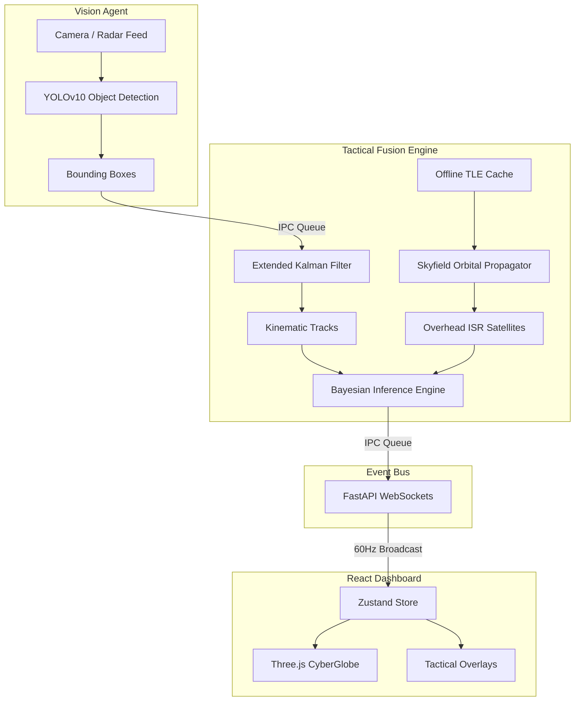

<div align="center">
  

  <h1>PROJECT SUDARSHAN</h1>
  <p><strong>Quad-Domain Autonomous C4ISR | Air · Land · Sea · Space</strong></p>
  <p><i>Submission for FAR AWAY 2026: India's Biggest International Hackathon</i></p>

  <p>
    
    
    
    
  </p>
</div>

---

## 🎯 Problem Statement
Modern military and border security operations suffer from **Sensor Fragmentation**. Radar tracks, drone video feeds, and satellite orbital data live in isolated silos. When an unknown UAV crosses a border, operators must mentally fuse radar blips with grainy video and calculate if an adversary satellite is currently flying overhead photographing the response. This cognitive overload leads to delayed threat neutralization.

## 💡 The Solution
**Project Sudarshan** is a deterministic, air-gapped edge-computing node that acts as an autonomous command nexus. It ingests computer vision streams, tracks kinematic trajectories, calculates real-time satellite orbital mechanics, and uses **Bayesian Probability** to statistically fuse these weak, isolated signals into high-confidence threat profiles.

Built entirely for edge hardware, Sudarshan requires **zero cloud dependencies** and operates offline to survive electronic warfare environments.

---

## 🚀 Key Features

*   **🛰️ Orbital Intelligence (SGP4):** Autonomously calculates the Topocentric coordinates (Elevation, Azimuth, Range) of every active satellite passing overhead to evaluate surveillance risk.
*   **🎯 Extended Kalman Filter (EKF):** Predicts the kinematic path of UAVs/Vessels, seamlessly tracking targets even when they fly behind mountains or clouds (Occlusion Bridging).
*   **🧠 Bayesian Sensor Fusion:** Fuses Vision Confidence (YOLOv10), Kinematic Speed, and Orbital Risk to calculate a unified Mathematical Threat Probability.
*   **⚡ Zero-API Architecture:** Runs 100% locally via isolated Python multiprocessing queues, ensuring the heavy math never bottlenecks the React UI.

---

## 🛠️ Tech Stack & Architecture

### The Agents (Backend)
- **Computer Vision:** `Ultralytics YOLOv10`, `OpenCV`
- **Kinematic & Math:** `NumPy`, `SciPy` (Mahalanobis Distance, NMS)
- **Orbital Dynamics:** `Skyfield`, `sgp4`
- **Orchestration:** `multiprocessing.Queue`, `FastAPI`, `WebSockets`

### The Nexus (Frontend)
- **Core:** `React 18`, `Vite`
- **State Management:** `Zustand` (for 60Hz decouple)
- **3D Visualization:** `Three.js`, `@react-three/fiber`, Custom GLSL Shaders
- **Styling:** `TailwindCSS`

### System Architecture Pipeline


---

## 📺 Demonstration & Execution

Sudarshan ships with built-in synthetic trajectories to demonstrate the Extended Kalman Filter bridging "occlusion events" (e.g. a drone flying behind a mountain). 

### Setup Instructions
1. Clone the repository to an Ubuntu/Parrot OS or Windows Edge Node.
2. Ensure you have Python 3.10+ and Node.js 18+ installed.

```bash
# 1. Install Dependencies
make install

# 2. Pre-fetch offline dependencies (YOLO weights & TLE Satellite data)
make cache-tle

# 3. Boot the Quad-Domain Nexus
make run
```
*The `demo_start.sh` script will automatically spin up the IPC queues, load the AI models, start the React dev server, and open the UI in your browser.*

### Testing the System
Once the dashboard opens:
1. Observe the **SGP4 Orbital Panel** tracking overhead satellites.
2. Watch the **Tactical Fusion Panel** actively assess the synthetic drone feed.
3. Click **Inject: Red Alert** to simulate a coordinated swarm attack and watch the Bayesian probability spike and update the GLSL Earth Shaders.

---

## 🔮 Future Scope
- **Hardware Integration:** Swap the synthetic `video_source.py` for direct RTSP links to FLIR thermal cameras.
- **Drone Swarm Countermeasures:** Implement UDP broadcast out to an active defense grid (e.g. RF Jammers) to automatically neutralize targets hitting a >95% Bayesian threat probability.
- **Naval Domain Expansion:** Integrate AIS (Automatic Identification System) local radio intercepts into the Fusion Engine.

---
*Developed for FAR AWAY 2026 Hackathon. "Build intelligent systems that can think, decide and act independently."*
