  

# EXECUTIVE SUMMARY: PROJECT SUDARSHAN
**CLASSIFICATION: UNCLASSIFIED / FOR DEMO PURPOSES ONLY**

## 1. SITUATION
Current edge-defense nodes suffer from domain isolation. Radar operators track kinematics, visual operators track optics, and space-command tracks orbital ISR windows. This fragmentation results in cognitive overload and degraded threat neutralization times during coordinated swarm attacks.

## 2. MISSION
Develop and deploy a Quad-Domain (Air, Land, Sea, Space) autonomous C4ISR nexus capable of operating on isolated edge hardware, instantly fusing weak signals into high-confidence threat profiles via Bayesian statistics.

## 3. EXECUTION
Project Sudarshan executes this mission by decoupling the pipeline into four independent mathematical/AI agents. By utilizing an Extended Kalman Filter (EKF), the system bridges visual occlusion events, eliminating track fragmentation. Concurrently, SGP4 orbital propagation assesses overhead satellite risks without requiring cloud connectivity.

## 4. ADMINISTRATION & LOGISTICS
The system is built on an open-source, vendor-agnostic tech stack (Python, React) allowing rapid deployment across diverse hardware architectures (x86_64, ARM) including standard commercial-off-the-shelf (COTS) laptops.

## 5. COMMAND & SIGNAL
All data routing is handled via local OS IPC (Inter-Process Communication) and zero-API WebSockets, ensuring electronic emissions and API vulnerabilities are completely neutralized.
