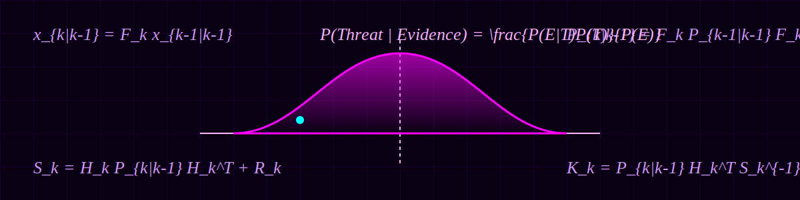

  

# Mathematical Specification

Sudarshan leverages rigorous physics and statistical models to fuse multi-domain data.

## 1. Extended Kalman Filter (EKF)
The Kinematic Agent uses an EKF to predict and update target state: \( x_k = [x, y, \dot{x}, \dot{y}]^T \)

### Prediction Step
Projects the state forward in time (bridging visual occlusion):
\[ x_{k|k-1} = F_k x_{k-1|k-1} \]
\[ P_{k|k-1} = F_k P_{k-1|k-1} F_k^T + Q_k \]
*(Where \(F\) is the state transition matrix and \(Q\) is process noise)*

### Update Step (When YOLO detects)
\[ y_k = z_k - H_k x_{k|k-1} \]
\[ S_k = H_k P_{k|k-1} H_k^T + R_k \]
\[ K_k = P_{k|k-1} H_k^T S_k^{-1} \]
\[ x_{k|k} = x_{k|k-1} + K_k y_k \]
\[ P_{k|k} = (I - K_k H_k) P_{k|k-1} \]

## 2. Orbital Mechanics (SGP4)
Calculates real-time topocentric coordinates of satellites using the standard SGP4 algorithm.
- Input: Two-Line Elements (TLE)
- Output: Earth-Centered Earth-Fixed (ECEF) coords.

Transformation to Topocentric (Azimuth, Elevation) for the local observer:
\[
\begin{bmatrix}
x_{topo} \\ y_{topo} \\ z_{topo}
\end{bmatrix}
=
\begin{bmatrix}
-\sin \lambda & \cos \lambda & 0 \\
-\sin \phi \cos \lambda & -\sin \phi \sin \lambda & \cos \phi \\
\cos \phi \cos \lambda & \cos \phi \sin \lambda & \sin \phi
\end{bmatrix}
\begin{bmatrix}
x_{ECEF} - x_{obs} \\
y_{ECEF} - y_{obs} \\
z_{ECEF} - z_{obs}
\end{bmatrix}
\]

## 3. Bayesian Threat Fusion
Fuses the vision confidence \( P(V|T) \), kinematic risk \( P(K|T) \), and orbital risk \( P(O|T) \) using Bayes' Theorem:

\[ P(Threat | Evidence) = \frac{ P(E | T) P(T) }{ P(E | T) P(T) + P(E | \neg T) P(\neg T) } \]

Where Evidence \(E\) is the joint distribution assuming conditional independence:
\[ P(E|T) = P(V|T) \times P(K|T) \times P(O|T) \]
